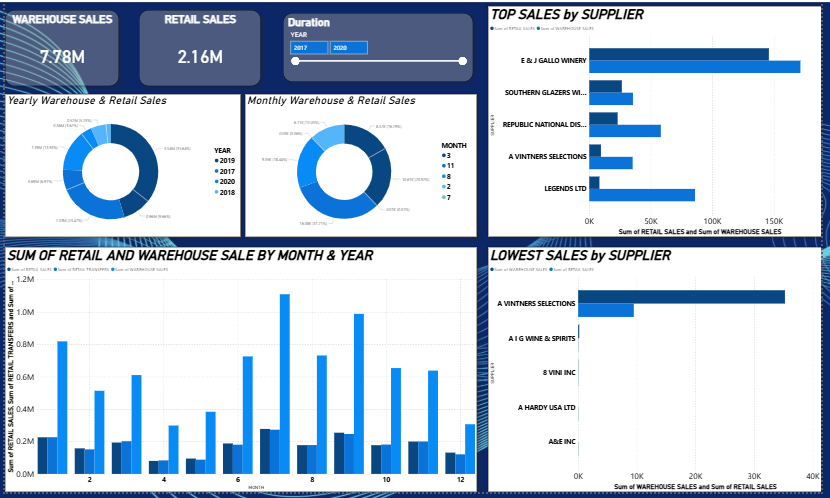

# Sales Forecasting & Supplier Analysis Dashboard

## Project Overview
This project uses **Power BI** to analyze warehouse and retail sales data.  
It provides insights into supplier performance, demand vs. supply balance, and forecasts future sales.

## Key Features
- **Warehouse vs. Retail Sales** – Compare yearly and monthly trends.  
- **Supplier Performance** – Identify top and underperforming suppliers.  
- **Demand & Supply Balance** – Track sales and transfers across supply chain.  
- **Time-Series Forecasting** – Predict future sales trends.  

## Dashboard Preview

## Tools Used
- Microsoft Power BI  
- Dataset: Warehouse & Retail Sales (CSV)  

## Insights
- Warehouse sales significantly exceed retail sales.  
- A few suppliers contribute the majority of sales.  
- Some suppliers are consistently underperforming.  
- Forecasting highlights potential sales trends for decision-making.  

---
